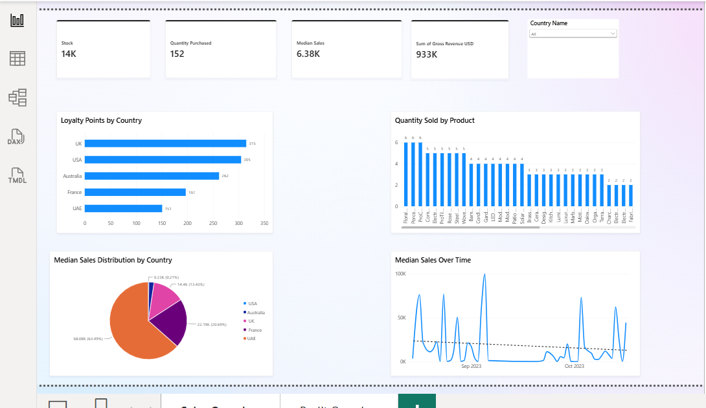
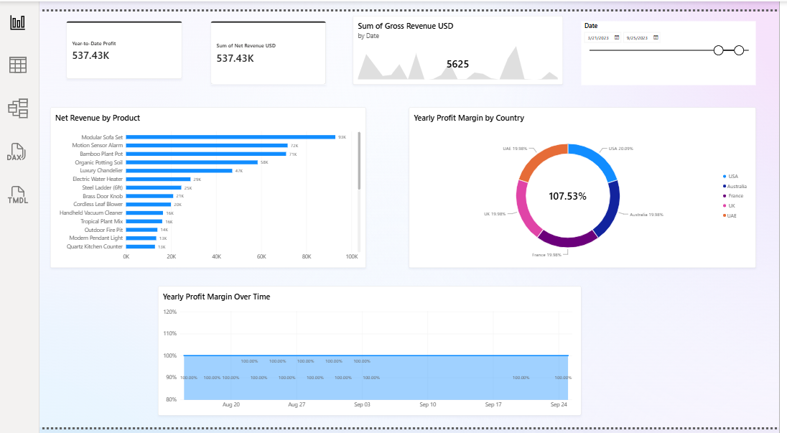
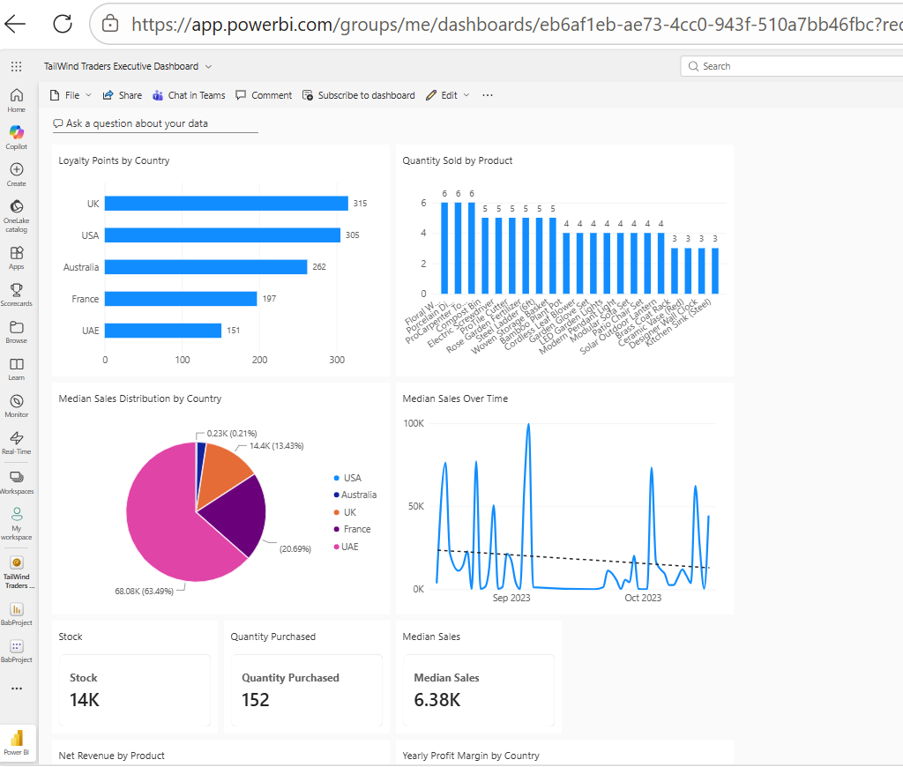
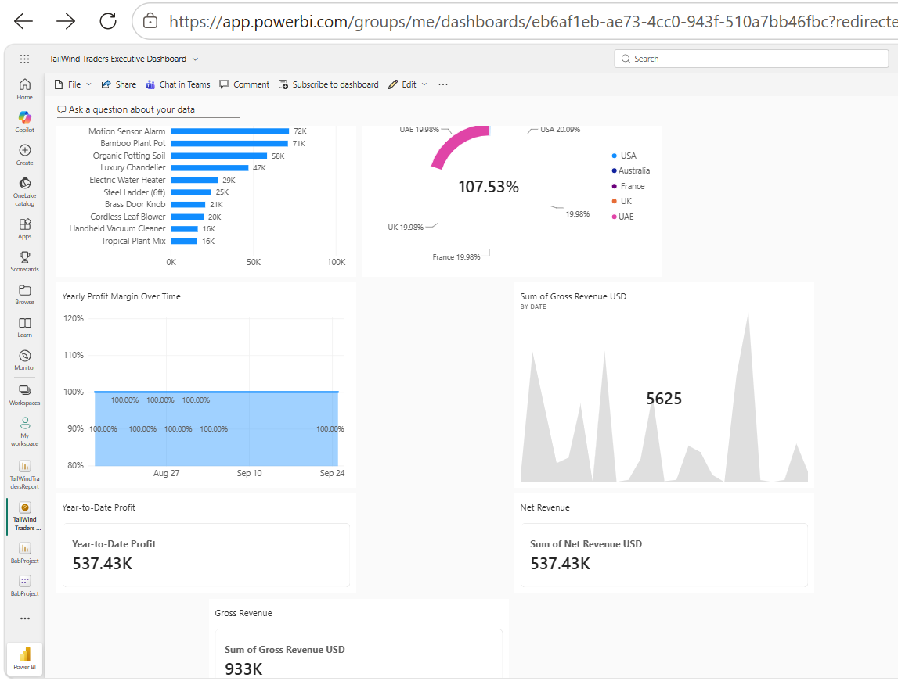

# Tailwind Traders Sales & Profit Analytics

## Project Overview

This project presents an end-to-end Power BI solution developed to analyze Tailwind Traders' sales, profitability, inventory, product performance, and geographic trends.

The solution combines data transformation, data modeling, DAX calculations, interactive reporting, and Power BI Service capabilities to provide both detailed analysis and executive-level performance monitoring.

## Business Objective

The objective of this project was to transform raw sales and purchasing data into actionable business insights and create an interactive reporting solution that enables users to:

- Monitor sales and revenue performance
- Analyze product performance
- Compare performance across countries
- Track inventory and purchasing activity
- Analyze profitability over time
- Monitor key business metrics through an executive dashboard

## Tools & Technologies

- Power BI Desktop
- Power BI Service
- Power Query
- DAX
- Data Modeling
- Data Visualization

## Data Preparation & Modeling

Data from sales, purchases, countries, and exchange-rate sources was prepared and integrated for analysis.

Key development activities included:

- Cleaning and transforming data
- Creating relationships between tables
- Building a Calendar table for time-based analysis
- Converting financial values into USD
- Creating calculated metrics and DAX measures
- Building an interactive analytical data model

## Key DAX Measures

The project includes measures for:

- Median Sales
- Quarterly Profit
- Year-to-Date Profit
- Yearly Profit Margin

The complete DAX formulas are documented in [`dax/measures.md`](dax/measures.md).

## Sales Overview

The Sales Overview report provides visibility into:

- Stock levels
- Quantity purchased
- Gross revenue in USD
- Median sales
- Loyalty points by country
- Quantity sold by product
- Median sales distribution by country
- Sales trends over time
- Interactive country filtering



## Profit Overview

The Profit Overview focuses on profitability and revenue performance, including:

- Year-to-Date Profit
- Net Revenue
- Gross Revenue trends
- Net Revenue by Product
- Yearly Profit Margin by Country
- Profit Margin trends over time
- Date-based filtering



## Executive Dashboard

The completed report was published to Power BI Service, where key visualizations and KPI cards were combined into an executive dashboard for centralized performance monitoring.

Power BI Service capabilities implemented in this project include:

- Dashboard tiles
- KPI monitoring
- Threshold-based data alerts
- Scheduled weekly report subscriptions
- Report publishing and sharing capabilities



Additional dashboard content:



## Key Insights

The analysis highlighted differences in sales performance across countries and products, while providing visibility into revenue, inventory, purchasing activity, and profitability trends.

The interactive report enables users to drill into performance by country, product, and time period to support data-driven decision-making.

## Repository Structure

```text
Tailwind-Traders-Power-Bi-Analysis/
│
├── README.md
├── TailWindTradersReport.pbix
├── dax/
│   └── measures.md
└── screenshots/
    ├── Sales_Overview.png
    ├── Profit_Overview.png
    ├── Executive_Dashboard1.png
    └── Executive_Dashboard2.png
```

## Power BI Report

The complete Power BI Desktop report is available in this repository:

`TailWindTradersReport.pbix`

## Skills Demonstrated

Power BI | Power Query | DAX | Data Modeling | Data Visualization | Business Intelligence | KPI Development | Dashboard Design | Power BI Service
